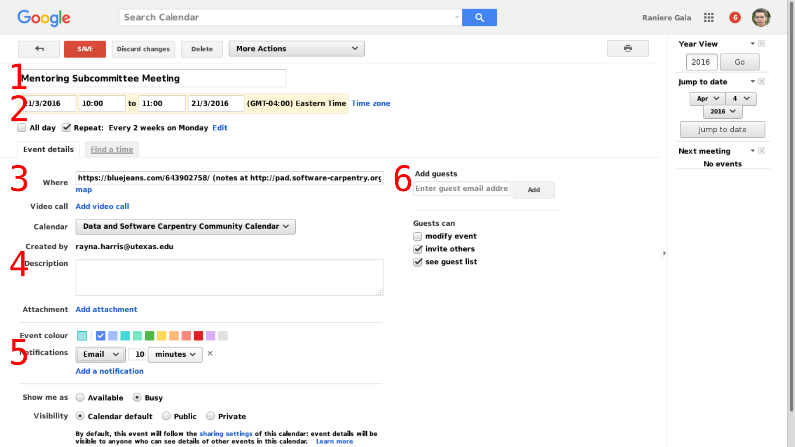

# Mentoring Subcommittee Roles Roles and Responsibilities

## Roles

The members of the Mentoring Subcommittee may have particular roles within the 
functioning of the subcommittee. These roles include:

* [Chair](#chair)
* [Vice Chair](#vicechair)
* [Secretary](#secretary)

### Chair

The Chair is meant to organize and facilitate the activities of the Committee.
The Chair agrees to:

1.  Organize/schedule meetings at the agreed-upon frequency.

2.  Ensure that an agenda is planned and circulated in a timely
    fashion.

3.  Lead meetings fairly and transparently (or delegate meeting
    leadership when absent).

4.  Serve as the primary liaison for communication between the
    community and the Mentoring Subcommittee members.

### Vice Chair

The Vice Chair is meant to support the duties of the chair. In particular, the 
Vice Chair should adopt the responsibilities of the Chair when the Chair is 
temporarily unable to perform their duties (e.g., absent from a meeting, 
stepping down during a vote temporarily due to conflict of interest). The Vice
Chair agrees to:

1.  Adopt the duties and authority of the Chair at the request of the Chair or
    by vote of the Committee.

2.  Act as the primary liaison between the Steering Committee and the Subcommittee.

### Secretary

The Secretary is meant to maintain records of a non-financial nature. The Secretary agrees to:

1. Facilitate the formation of meeting minutes.

3. Archive and publish the meeting minutes [in the GitHub repository][minutes-repository].

4. Manage, maintain, and facilitate other record keeping tasks where necessary.

## Operations

### Meeting

1. Chair creates agenda for the meeting with one week in advace.

   The agenda can be created on http://pad.software-carpentry.org/.

2. Chair creates calendar event for the meeting with one week in advance.

   The calendar event can be created on http://calendar.google.com/.

3. Secretary takes notes during the meeting.

4. Secretary creates [GitHub issues][repository] for action items.

5. Secretary creates pull request with minutes archives.

6. Vice-chair merges the minutes.

7. Vice-chair reports meetings during Steering Committee meeting.

## Apendices

### Time

1. Meetings need to be run at least twice on the same day to accommodate different timezones.

2. Meeting time must be on UTC to be fair with everyone.

### Etherpad operation

1. Use the same Etherpad because this will help people remember it.

2. After each meeting, star the etherpad. You will find this option on the top
   right of the etherpad.

3. Save a copy of the etherpad on the GitHub repository.

### Google Calendar operation

When creating a new event or updating a old one.

1. Set the name of the event or meeting.

2. Set the date. **Please use UTC time.**
   If using Google Calendar select Accra, Ghana or Reykjavik, Iceland
   since they don't have daylight saving time.

3. Set the location.
   If using Google Hangout select "Add video call".
   Otherwise add the link to the video conference room.

4. Set the description.
   **The link to the agenda goes here.**

5. Set notifications.
   Is good to have one notification on the day before and another 10 minutes before the meeting
   as email.

6. Set guests.
   For mentoring subcommittee meetings those are all the members of the subcommittee.
   For discussion sessions those are all the instructors that you invited.

[repository]: https://github.com/swcarpentry/board/
[minutes-repository]: https://github.com/swcarpentry/board/tree/master/subcommittee/mentoring/
